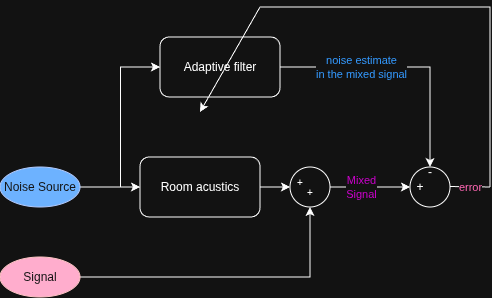

# Noise Cancellation

## Introduction

The setup consists of a primary microphone that captures a mixture of a desired signal and noise, and a secondary microphone positioned closer to the noise source. The secondary microphone provides a reference noise signal that is correlated with the noise component present in the primary microphone signal, while remaining uncorrelated with the desired signal. 

The objective of the system is to attenuate the noise component in the primary microphone signal while preserving the desired signal as accurately as possible.

The adaptive filters that I implemented can be found in the file `Adaptive_filters.py`
- A recursive least squares filter: `RLS_filter`
- A normalized least mean squares filter: `NLMS_filter`

For details about the functions, check the descriptions in the function definitions.

## Conceptual view

The adaptive noise cancellation process can be summarized as follows as follows. The reference noise signal (Noice Source) acquired by the secondary microphone is passed through the adaptive FIR filter, which estimates the noise component present in the primary microphone signal (Mixed Signal). The filter coefficients are continuously adapted to improve the estimate (minimizing the error).

The error signal turns out to be the filtered signal.

